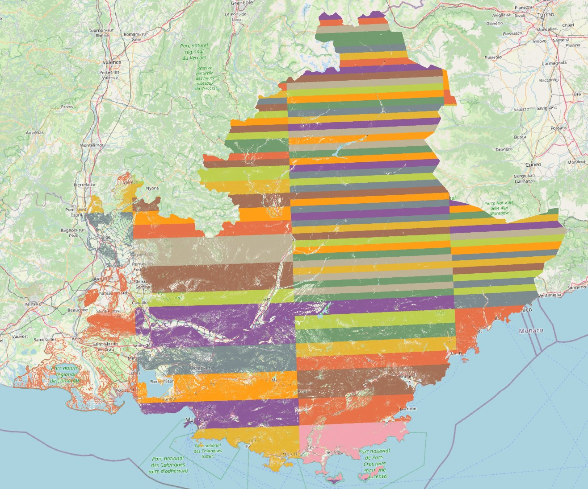
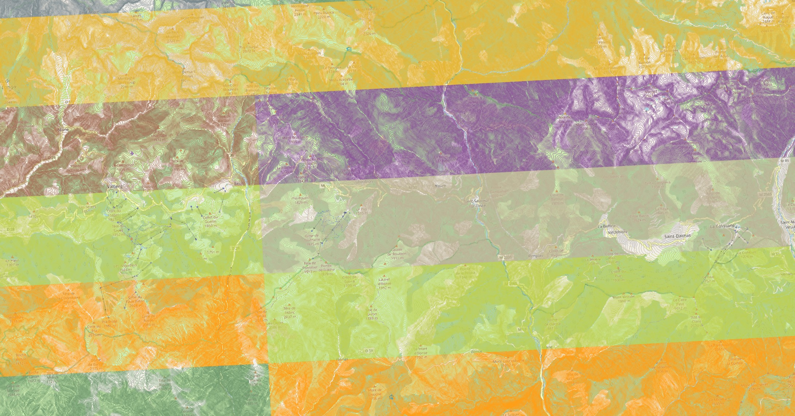
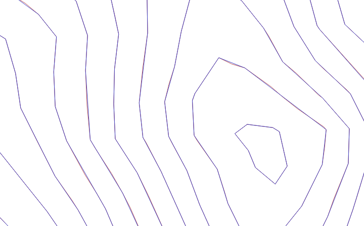
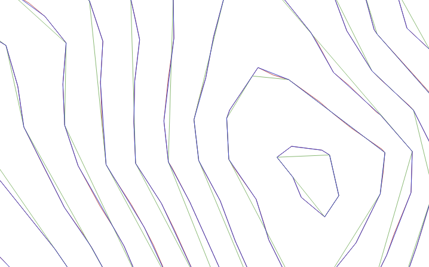

[](https://www.python.org)


[](https://github.com/psf/black)
[](https://github.com/pypa/hatch)
[](https://github.com/charliermarsh/ruff)
[](https://github.com/python/mypy)
[](https://deepsource.io/gh/agrenott/pyhgtmap/?ref=repository-badge)
[](https://app.codacy.com/gh/agrenott/pyhgtmap/dashboard?utm_source=gh&utm_medium=referral&utm_content=&utm_campaign=Badge_grade)
[](https://codeclimate.com/github/agrenott/pyhgtmap/maintainability)

pyhgtmap is a fork of the original  tool,
which doesn't seem to be maintained anymore.

This is a little program which lets you easily generate OSM contour lines from
NASA SRTM data.  It was initially created as replacement for srtm2osm which
stopped working when the NASA changed the server and started distributing the
raw SRTM data via http instead of ftp.  In the meanwhile, srtm2osm is working
again due to the efforts of bomm.

However, pyhgtmap has some advantages compared to srtm2osm.  One is that you
won't need a C# runtime environment installed on your machine.  Another
important thing is that pyhgtmap generates already tiled data.  Furthermore,
pyhgtmap seems to slightly outperform srtm2osm.  If you are using a multi-core
machine and are running a POSIX compliant operating system you can use a very
simple form of parallelization and the advance will be dramatical.

Note that the intended use is not to upload generated contour OSM data to the
OSM servers but to use it for fancy maps.

# Installation

For ubuntu-like system:

## Ligther deployment (without GeoTiff support)

GDAL dependency is required only to add GeoTiff support, and is quite painful to install.
If you don't need GeoTiff support, simply install the default version of pyhgtmap:

```bash
sudo apt update
sudo apt install python3 python3-pip python3-venv
python3 -m venv my_venv
# Switch to venv
. ./my_venv/bin/activate
# Install pyhgtmap with dependencies from PyPi
pip install pyhgtmap
```

## With GeoTiff optional support

```bash
sudo apt update
sudo apt install python3 python3-pip python3-venv
# Install GDAL via system package, as it's painful to install through PIP
sudo apt install python3-gdal 
# Create virtual env (allow --system-site-packages to use system's GDAL)
python3 -m venv --system-site-packages my_venv
# Switch to venv
. ./my_venv/bin/activate
# Install pyhgtmap with dependencies from PyPi
pip install pyhgtmap[geotiff]
```

## Install directly from GitHub (useful to test non-released fixes)

```bash
sudo apt update
sudo apt install python3 python3-pip python3-venv git
python3 -m venv my_venv
# Switch to venv
. ./my_venv/bin/activate
# Install latest pyhgtmap development version from github
pip install -U git+https://github.com/agrenott/pyhgtmap.git
```

# Usage

For a detailed help, run `pyhgtmap --help` on the console.

## Example output

Generating contours for France [PACA region](https://download.geofabrik.de/europe/france/provence-alpes-cote-d-azur.html) with a 10m step and 0.00001 RDP Epsilon (taking less than a minute on Intel 13600K via Windows WSL 1):

```
> pyhgtmap --polygon=provence-alpes-cote-d-azur/provence-alpes-cote-d-azur.poly --step=10 --pbf --hgtdir=work/hgt --source=view1,view3 --simplifyContoursEpsilon=0.00001 -j16
...
> du -shc lon*.pbf |tail -3
196K    lon7.00_7.75lat44.69_44.75_view1.osm.pbf
168K    lon7.00_7.75lat44.75_44.88_view1.osm.pbf
81M     total
> ls -l lon*.pbf |wc -l
104
```

Contour lines displayed over OSM map using QGis:





## A word on contour simplification

pyhgtmap now uses very efficient [pybind11-rdp](https://github.com/cubao/pybind11-rdp) Ramer-Douglas-Peucker Algorithm library for contour simplification. This makes RDP activation the best solution in most cases, as the slight overhead in computing performance is compensated by the reduced number of points to write (which is now the most time consuming part). It also reduces the final file size.

Epsilon value must be chosen with care to get the proper tradeoff between efficiency and quality.

Here is an example originating from a "view1" source with 10m step (lon6.00_7.00lat43.00_43.25_view1.osm.pbf):

|         RDP Epsilon values          | Disabled |   0    |                                       0.00001                                       |                                      0.0001                                       |
| :---------------------------------: | :------: | :----: | :---------------------------------------------------------------------------------: | :-------------------------------------------------------------------------------: |
|           Visual details            |          |        |                 |  |
|                                     |          |        | Blue lines (Epsilon=0.00001) are almost indistinguishable from red ones (Epsilon=0) |            Clear difference appears for green lines (Epsilon = 0.0001)            |
| File size (1 tile, PBF format, KiB) |   1840   |  1717  |                                        1424                                         |                                        716                                        |
|      Number of nodes (1 tile)       |  869685  | 761085 |                                       559678                                        |                                      210744                                       |

# Development

This project uses .

The one-liner for formatting and local validation:
```bash
hatch run fmt && hatch run all
```

## Profiling

```bash
pip install yappi
python -m yappi -f callgrind -o yappi_ex1.out ../../pyhgtmap/main.py --pbf --log=DEBUG N43E006.hgt
```

Then open `yappi_ex1.out` with some callgrind viewer (eg. QCacheGrind).
